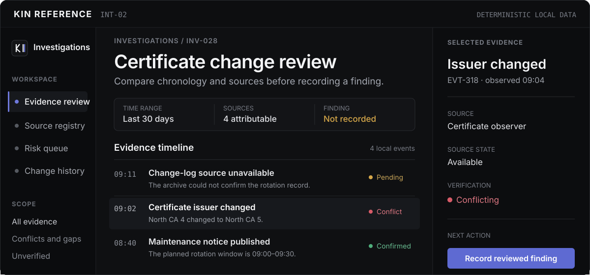

<p align="center">
  <a href="https://yehyakin.github.io/kin-design-system/">
    
  </a>
</p>

<h1 align="center">KIN Design System</h1>

<p align="center">
  <strong>Design rules and runnable references for clear, information-rich products.</strong>
</p>

<p align="center" aria-label="Language">
  <a href="./READMEs/README.zh-CN.md">中文</a> &nbsp;|&nbsp; <strong>[English]</strong>
</p>

<p align="center">
  <a href="https://yehyakin.github.io/kin-design-system/">Explore references</a> &nbsp;·&nbsp;
  <a href="./DESIGN.md">Read the design contract</a> &nbsp;·&nbsp;
  <a href="./adoption/README.md">Open the adoption guide</a>
</p>

<p align="center">
  <a href="https://yehyakin.github.io/kin-design-system/examples/workspace-reference/?view=investigation&amp;lang=en">
    <picture>
      <source media="(max-width: 520px)" srcset="./assets/readme-hero-mobile.svg" />
      
    </picture>
  </a>
</p>

<p align="center">
  <sub>Illustrated reconstruction of the deterministic investigation reference</sub>
</p>

> **Version status:** [v3.0.3](https://github.com/yehyakin/kin-design-system/releases/tag/v3.0.3) is the current release. The `main` branch may contain later documentation work.

KIN is a framework-neutral design contract for teams building websites and software where people need to read, compare, decide, and act without losing context. It covers page composition, components, themes, motion, accessibility, data states, AI-assisted work, and recovery.

## See KIN at work

These pages use fixed local fixtures so the same states can be inspected repeatedly. They show KIN composition and behavior; they are not production services or proof that another product has completed adoption.

- [**Investigation and evidence review**](https://yehyakin.github.io/kin-design-system/examples/workspace-reference/?view=investigation&lang=en) — compare chronology, sources, conflicts, and uncertainty before recording a finding.
- [**Reading with provenance**](https://yehyakin.github.io/kin-design-system/examples/product-patterns/information.html?lang=en) — keep headings, citations, source context, and related records in a stable reading path.
- [**Product detail and edit**](https://yehyakin.github.io/kin-design-system/examples/product-patterns/ecommerce.html?lang=en) — edit a product while price, inventory, channels, approval, and activity remain distinct.
- [**Canvas edit and undo**](https://yehyakin.github.io/kin-design-system/examples/product-patterns/canvas.html?lang=en) — keep the canvas dominant while tools, layers, generated changes, and recovery stay available.

More references: [Scenario Atlas](https://yehyakin.github.io/kin-design-system/scenarios/) · [Core components](https://yehyakin.github.io/kin-design-system/examples/workspace-reference/core-components.html?lang=en) · [Sign-in and recovery](https://yehyakin.github.io/kin-design-system/examples/page-patterns/access.html?lang=en) · [Motion and feedback](https://yehyakin.github.io/kin-design-system/examples/workspace-reference/motion.html?lang=en) · [Runtime integrations](https://yehyakin.github.io/kin-design-system/examples/workspace-reference/integrations.html?lang=en)

## What KIN provides

- **A shared design contract.** [`DESIGN.md`](./DESIGN.md) defines the normative rules; [`VISION.md`](./VISION.md) and the [visual signature](./principles/visual-signature.md) explain the product direction and acceptance criteria.
- **Runnable reference interfaces.** Complete tasks, responsive layouts, themes, motion, failure, permission, empty, and recovery states can be inspected in a browser.
- **Four route-level product profiles.** Use [`information-site`](./patterns/information-site.md), [`intelligence-workspace`](./patterns/intelligence-workspace.md), [`ecommerce-operations`](./patterns/ecommerce-operations.md), or [`engineering-canvas`](./patterns/engineering-canvas.md) for the route being changed. One product may use more than one profile.
- **Component and page contracts.** KIN records purpose, structure, states, motion, accessibility, maturity, and anti-patterns without forcing one application template.
- **Adoption and verification tools.** Project-owned briefs and evidence records keep implementation, review, release, and rollback separate.

A KIN interface is not identified by an indigo accent, a dark theme, or a three-column shell. The result should make the task or document dominant, preserve useful context, separate business semantics, cover non-happy paths, and use motion only when it explains a state change or spatial relationship.

## Start using KIN

### Review or design an interface

Read these files in order:

1. [Product direction](./VISION.md)
2. [Design contract](./DESIGN.md)
3. [Visual signature](./principles/visual-signature.md)
4. [Delivery model](./DELIVERY.md)

No framework installation is required to use KIN as a design or review reference.

### Adopt the stable contract

Run the adoption tools from a pinned KIN checkout:

```bash
git clone --branch v2.3.0 --depth 1 https://github.com/yehyakin/kin-design-system.git
cd kin-design-system
node scripts/init-adoption.mjs ../your-project --profile information-site
node scripts/check-adoption.mjs ../your-project
node scripts/audit-project.mjs ../your-project
```

The initializer creates a project-owned implementation brief and evidence record. It does not rewrite product code or mark adoption complete. Read the [adoption guide](./adoption/README.md) before migration.

<details>
<summary>Use KIN with a coding tool</summary>

Tools that support Agent Skills can load:

```text
skills/kin-design/SKILL.md
```

For other coding tools, start with this instruction:

```md
Read DESIGN.md, DELIVERY.md, and principles/visual-signature.md before changing
the interface. Start from the product's real task, content, data, routes,
permissions, and existing components. If kin.config.json exists, read its
implementation brief and route/profile map.

Before coding, report the KIN composition checkpoint, proposed changes, risks,
verification plan, and rollback. Do not replace a workflow with a component
gallery, invent data, or claim KIN adoption from Tokens or a passing build.
```

The Skill helps coding tools apply KIN; agent integration is not the direction of the system.

</details>

## Runtime integrations

KIN uses selected upstream packages through thin adapters. The upstream package keeps its mature behavior and motion; KIN supplies semantics, Tokens, themes, product boundaries, verification, migration, and rollback.

- **Core visual adapter:** [Lucide](./integrations/lucide.md)
- **Stable runtime contracts:** [cmdk](./integrations/cmdk.md), [React Virtuoso](./integrations/virtuoso.md), and [Sonner](./integrations/sonner.md)
- **Conditional runtime contracts:** [NumberFlow](./integrations/number-flow.md), [Liveline](./integrations/liveline.md), [dnd kit](./integrations/dnd-kit.md), and [input-otp](./integrations/input-otp.md)
- **Development only:** [Leva](./integrations/leva.md)

No product needs every integration. Check the current package, license, maintenance, bundle cost, rendering behavior, accessibility, and rollback before adoption. The private pre-release `@kin-design/react` package remains an integration laboratory, not a published universal dependency.

## Delivery boundaries

- **KIN provides:** normative documentation, generated Tokens, framework-free references, verification tooling, an Agent Skill, adoption records, and Figma Variables interoperability.
- **The consuming product owns:** production components, brand, routes, data, permissions, analytics, integrations, release, and rollback.
- **KIN does not currently claim:** a published Figma Component Library, a universal runtime package, automatic redesign, or production adoption proved by a showcase fixture.

The complete ownership and promotion rules are in [DELIVERY.md](./DELIVERY.md). Accessibility, cross-browser support, production adoption, and visual quality are separate claims and require the evidence named in the [verification requirements](./principles/verification.md).

<details>
<summary>KIN 3.0 development and distribution status</summary>

After a validated `main` deployment, the reviewed current contract can appear as raw Markdown and JSON under the mutable [`/next/`](https://yehyakin.github.io/kin-design-system/next/design.md) channel. `next` is for discovery and development, not a production pin.

While an untagged release candidate is staged on `main`, the complete Pages deployment is deferred. The public showcase and `/next/` remain at the preceding verified deployment until the final GitHub Release exists.

No stable KIN 3.0 Agent bundle exists yet, and v2.3.0 is not backfilled. Production work should use the [complete v2.3.0 contract](https://github.com/yehyakin/kin-design-system/blob/v2.3.0/DESIGN.md) and [Skill from the same pinned checkout](https://github.com/yehyakin/kin-design-system/tree/v2.3.0/skills/kin-design). Release authority and immutable version availability are recorded in [`versions.json`](https://yehyakin.github.io/kin-design-system/versions.json).

</details>

## Contribute

KIN 3.0 development requires Node.js 20.11 or newer:

```bash
git clone https://github.com/yehyakin/kin-design-system.git
cd kin-design-system
npm ci
npx playwright install chromium firefox webkit
npm run validate
npm run test:reference
```

Read [CONTRIBUTING.md](./CONTRIBUTING.md) before changing normative rules. Component and page maturity is recorded in the [component catalog](./components/catalog.md) and [page catalog](./pages/catalog.md).

<p>
  <a href="./DESIGN.md"></a>
  <a href="https://github.com/yehyakin/kin-design-system/actions/workflows/validate-docs.yml"></a>
  <a href="./LICENSE"></a>
</p>

## Sources and license

KIN is independent. External projects provide evidence, techniques, and review questions; they do not become KIN rules automatically. KIN does not copy third-party brand assets, proprietary interfaces, fonts, icons, screenshots, or source code.

See [REFERENCES.md](./REFERENCES.md) for source hierarchy and attribution. KIN Design System is available under the [MIT License](./LICENSE).

<p align="center">
  Maintained by KiN3.
</p>
