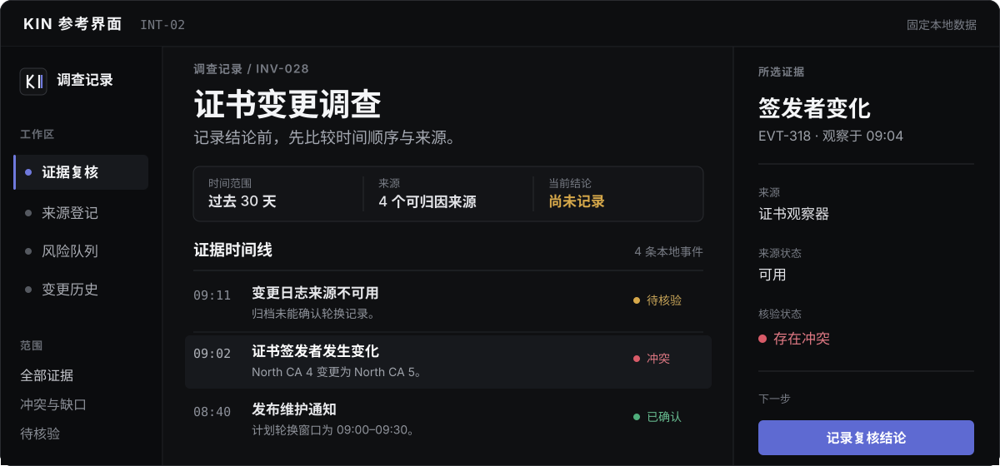

<p align="center">
  <a href="https://yehyakin.github.io/kin-design-system/zh/">
    
  </a>
</p>

<h1 align="center">KIN Design System</h1>

<p align="center">
  <strong>为清晰、信息密集型产品提供设计规则和可运行参考。</strong>
</p>

<p align="center" aria-label="语言">
  <strong>[中文]</strong> &nbsp;|&nbsp; <a href="../README.md">English</a>
</p>

<p align="center">
  <a href="https://yehyakin.github.io/kin-design-system/zh/">查看参考界面</a> &nbsp;·&nbsp;
  <a href="../DESIGN.md">阅读设计合同</a> &nbsp;·&nbsp;
  <a href="../adoption/README.md">打开接入指南</a>
</p>

<p align="center">
  <a href="https://yehyakin.github.io/kin-design-system/examples/workspace-reference/?view=investigation&amp;lang=zh-CN">
    <picture>
      <source media="(max-width: 520px)" srcset="../assets/readme-hero-mobile.zh-CN.svg" />
      
    </picture>
  </a>
</p>

<p align="center">
  <sub>基于固定数据调查参考界面的重绘</sub>
</p>

> **版本状态：** [v3.0.1](https://github.com/yehyakin/kin-design-system/releases/tag/v3.0.1) 是当前正式版本；`main` 分支可能包含后续文档更新。

KIN 是一套不绑定前端框架的设计合同，适用于需要阅读、比较、判断和操作，同时不能丢失上下文的网站与软件。它覆盖页面构图、组件、主题、动效、无障碍、数据状态、AI 辅助流程和恢复路径。

## 查看实际任务

以下页面使用固定的本地样例，便于反复检查同一状态。它们展示 KIN 的构图和行为，但不是生产服务，也不能证明其他产品已经完成接入。

- [**调查与证据复核**](https://yehyakin.github.io/kin-design-system/examples/workspace-reference/?view=investigation&lang=zh-CN) — 在记录结论前比较时间顺序、来源、冲突与不确定性。
- [**带来源阅读**](https://yehyakin.github.io/kin-design-system/examples/product-patterns/information.html?lang=zh-CN) — 在稳定的阅读路径中保留标题、引用、来源上下文和相关记录。
- [**商品详情与编辑**](https://yehyakin.github.io/kin-design-system/examples/product-patterns/ecommerce.html?lang=zh-CN) — 编辑商品时，让价格、库存、渠道、审批和活动保持清楚区分。
- [**画布编辑与撤销**](https://yehyakin.github.io/kin-design-system/examples/product-patterns/canvas.html?lang=zh-CN) — 让画布保持主导，同时保留工具、图层、生成结果和恢复路径。

更多参考：[场景目录](https://yehyakin.github.io/kin-design-system/scenarios/?lang=zh-CN) · [核心组件](https://yehyakin.github.io/kin-design-system/examples/workspace-reference/core-components.html?lang=zh-CN) · [登录与账户恢复](https://yehyakin.github.io/kin-design-system/examples/page-patterns/access.html?lang=zh-CN) · [动效与操作反馈](https://yehyakin.github.io/kin-design-system/examples/workspace-reference/motion.html?lang=zh-CN) · [运行时集成](https://yehyakin.github.io/kin-design-system/examples/workspace-reference/integrations.html?lang=zh-CN)

## KIN 提供什么

- **一份共用设计合同。** [`DESIGN.md`](../DESIGN.md) 记录规范性规则；[`VISION.md`](../VISION.md) 和[视觉特征](../principles/visual-signature.md)说明产品方向和验收条件。
- **可运行的参考界面。** 可以在浏览器中检查完整任务、响应式布局、主题、动效、失败、权限、空状态和恢复流程。
- **按路由选择的四种产品类型。** 根据当前路由选择 [`information-site`](../patterns/information-site.md)、[`intelligence-workspace`](../patterns/intelligence-workspace.md)、[`ecommerce-operations`](../patterns/ecommerce-operations.md) 或 [`engineering-canvas`](../patterns/engineering-canvas.md)。一个产品可以使用多种类型。
- **组件与页面合同。** KIN 记录用途、结构、状态、动效、无障碍、成熟度和反例，但不强制所有产品使用同一套应用模板。
- **接入与验证工具。** 由目标项目维护实施简报和证据记录，把实现、评审、发布和回滚分开管理。

KIN 不是靠靛蓝色、夜间主题或三栏框架被识别。最终界面应让任务或内容成为主角，保留必要上下文，分别表达业务语义，补齐正常流程以外的状态，并只在动效能说明状态变化或空间关系时使用它。

## 开始使用 KIN

### 评审或设计界面

按顺序阅读：

1. [产品方向](../VISION.md)
2. [设计合同](../DESIGN.md)
3. [视觉特征](../principles/visual-signature.md)
4. [交付方式](../DELIVERY.md)

只把 KIN 用作设计或评审参考时，不需要安装指定框架。

### 接入稳定版

从固定版本的 KIN 仓库运行接入脚本：

```bash
git clone --branch v2.3.0 --depth 1 https://github.com/yehyakin/kin-design-system.git
cd kin-design-system
node scripts/init-adoption.mjs ../your-project --profile information-site
node scripts/check-adoption.mjs ../your-project
node scripts/audit-project.mjs ../your-project
```

初始化器会创建由目标项目维护的实施简报和证据记录。它不会改写产品代码，也不会把接入自动标记为完成。开始迁移前请阅读[接入指南](../adoption/README.md)。

<details>
<summary>交给编码工具使用</summary>

支持 Agent Skill 的工具可以读取：

```text
skills/kin-design/SKILL.md
```

其他编码工具可以先收到这段指令：

```md
修改界面前，先阅读 DESIGN.md、DELIVERY.md 和
principles/visual-signature.md。从产品的真实任务、内容、数据、路由、
权限和现有组件出发。存在 kin.config.json 时，读取其中的实施简报和
路由/产品类型映射。

编码前先汇报 KIN 构图检查点、拟修改内容、风险、验证计划和回滚方式。
不得用组件画廊替代真实流程，不得编造数据，也不得用 Token 映射或
构建通过来宣称已经完成 KIN 接入。
```

Agent Skill 只是编码工具应用 KIN 的方式之一，不是 KIN 的产品方向。

</details>

## 运行时集成

KIN 通过轻量适配层使用经过选择的上游组件包。成熟的行为和动效仍由上游组件负责；KIN 负责语义、Token、主题、产品边界、验证、迁移和回滚。

- **核心图标适配：** [Lucide](../integrations/lucide.md)
- **稳定运行时合同：** [cmdk](../integrations/cmdk.md)、[React Virtuoso](../integrations/virtuoso.md)和 [Sonner](../integrations/sonner.md)
- **条件性运行时合同：** [NumberFlow](../integrations/number-flow.md)、[Liveline](../integrations/liveline.md)、[dnd kit](../integrations/dnd-kit.md)和 [input-otp](../integrations/input-otp.md)
- **仅开发环境：** [Leva](../integrations/leva.md)

没有任何产品需要安装全部集成。接入前仍需核对当前版本、许可证、维护状态、包体、渲染行为、无障碍和回滚方式。私有预发布的 `@kin-design/react` 仍是集成实验室，不是已经发布的通用依赖。

## 交付边界

- **KIN 提供：** 规范文档、生成的 Token、无框架参考页、验证工具、Agent Skill、接入记录和 Figma Variables 互操作。
- **接入产品负责：** 生产组件、品牌、路由、数据、权限、分析、集成、发布和回滚。
- **KIN 目前不声称提供：** 已发布的 Figma Component Library、通用运行时组件包、自动重构，或仅凭展示页就成立的生产接入。

完整的所有权和晋升规则见 [DELIVERY.md](../DELIVERY.md)。无障碍、跨浏览器支持、生产接入和视觉质量是不同结论，需要分别提供[验证要求](../principles/verification.md)中列出的证据。

<details>
<summary>KIN 3.0 开发与分发状态</summary>

经过校验的 `main` 部署完成后，当前已评审合同可以原始 Markdown 和 JSON 形式出现在可变的 [`/next/`](https://yehyakin.github.io/kin-design-system/next/zh/design.md) 通道。`next` 只用于发现和开发，不能作为生产固定版本。

尚未创建 Tag 的发布候选暂存在 `main` 时，完整 Pages 部署会延后。公开展示页与 `/next/` 会保持在上一个已验证部署，直到最终 GitHub Release 存在。

目前还没有稳定的 KIN 3.0 Agent 版本，也不会事后为 v2.3.0 补档。生产工作应使用[完整的 v2.3.0 合同](https://github.com/yehyakin/kin-design-system/blob/v2.3.0/DESIGN.md)和[同一固定版本中的 Skill](https://github.com/yehyakin/kin-design-system/tree/v2.3.0/skills/kin-design)。发布权限和不可变版本状态以 [`versions.json`](https://yehyakin.github.io/kin-design-system/versions.json) 为准。

</details>

## 参与开发

KIN 3.0 开发需要 Node.js 20.11 或更高版本：

```bash
git clone https://github.com/yehyakin/kin-design-system.git
cd kin-design-system
npm ci
npx playwright install chromium firefox webkit
npm run validate
npm run test:reference
```

修改规范性规则前请阅读[贡献指南](../CONTRIBUTING.md)。组件和页面成熟度记录在[组件目录](../components/catalog.md)与[页面目录](../pages/catalog.md)中。

<p>
  <a href="../DESIGN.md"></a>
  <a href="https://github.com/yehyakin/kin-design-system/actions/workflows/validate-docs.yml"></a>
  <a href="../LICENSE"></a>
</p>

## 来源与许可证

KIN 是独立设计系统。外部项目可以提供证据、方法和评审问题，但不会自动成为 KIN 规则。KIN 不复制第三方品牌资产、专有界面、字体、图标、截图或源代码。

来源优先级和引用方式见 [REFERENCES.md](../REFERENCES.md)。KIN Design System 使用 [MIT License](../LICENSE)。

<p align="center">
  由 KiN3 维护。
</p>
